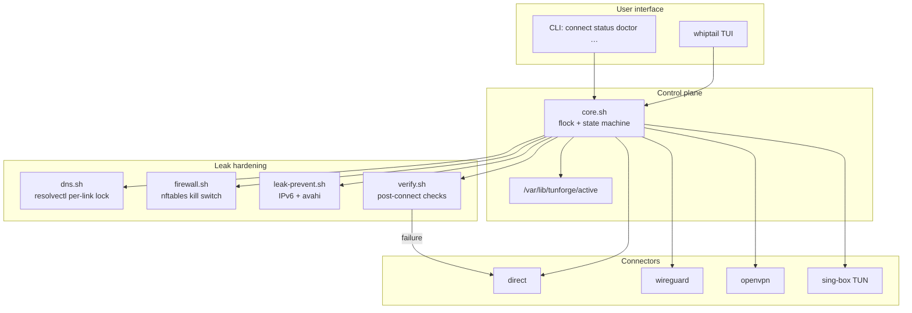

# Tunforge

**Languages / زبان‌ها / 语言 / Языки / زبانیں / Diller**

[English](#english) · [فارسی](#persian) · [中文](#chinese) · [Русский](#russian) · [اردو](#urdu) · [Türkmen](#turkmen)

---

<a id="english"></a>

## English

**Tunforge** is a single-source-of-truth VPN control plane for Ubuntu 22.04. It manages four mutually exclusive connection profile types and prevents DNS, IP, and IPv6 leaks — including across profile switches.

- **Direct** — no VPN; router-supplied DNS
- **WireGuard** — `wg-quick`-based, multi-server
- **OpenVPN** — `.ovpn` configs, multi-server
- **sing-box TUN** — system-wide tunnel for VMess / VLESS / Trojan / Shadowsocks

A `whiptail` TUI is the primary interface. Operations are serialized under `flock`, the previous profile is fully torn down before the next comes up, DNS is locked to the tunnel via `systemd-resolved` per-link routing, an `nftables` kill switch is installed, and IPv6 is disabled system-wide while a non-direct profile is active.

**Status:** tested and working on Ubuntu 22.04 (amd64 / arm64).

### Architecture

Tunforge is a small control plane: one CLI/TUI process owns connect/disconnect under a global lock, delegates tunnel bring-up to a connector, then hardens the host (DNS, nftables, IPv6) and verifies before declaring success.



**Connect path (happy path):**

1. Acquire `flock` on `/var/lib/tunforge/lock`
2. Tear down the previous profile completely (connector down + DNS revert + firewall clear + IPv6 restore as needed)
3. Bring up the selected connector (WireGuard / OpenVPN / sing-box / direct)
4. Lock DNS to the tunnel iface (`resolvectl` + `~.` route-only domain)
5. Install the nftables kill switch (`inet tunforge`, output drop by default)
6. Disable IPv6 (non-direct) and stop LAN discovery noise
7. Run `verify.sh`; on failure, auto-rollback to direct

**Design principles:**

| Principle | How |
|---|---|
| Single source of truth | `/var/lib/tunforge/active` updated atomically; only one profile at a time |
| Serialized mutations | All connect/disconnect paths take the same flock |
| Fail closed | Kill switch + verify rollback; boot unit re-applies firewall before NetworkManager |
| Pluggable tunnels | Connectors share a thin contract; core owns policy, not protocol details |

Repo layout mirrors the runtime layout under `/usr/local` and `/etc/tunforge` (see [Layout](#layout-english)).

### Install (Ubuntu 22.04)

```bash
git clone <this-repo> tunforge
cd tunforge
sudo ./install.sh
```

What the installer does:

1. Preflight: Ubuntu 22.04 / `--force` for others, root, arch (amd64 / arm64), `systemd-resolved` present.
2. Apt: installs only what's missing — `wireguard-tools openvpn nftables whiptail iproute2 curl jq gawk dnsutils ca-certificates moreutils`.
3. sing-box: fetches the latest `.deb` from GitHub Releases for your arch, verifies SHA256 if a `.sha256` sidecar exists, then `dpkg -i`. Skip with `--no-singbox` or supply an offline `.deb` with `--singbox-deb /path/to/file.deb`.
4. Deploys binaries into `/usr/local/bin/`, libraries into `/usr/local/lib/tunforge/`, configs into `/etc/tunforge/`.
5. Installs `NetworkManager` and `systemd-resolved` drop-ins so they stop fighting over DNS / VPN interfaces, and points `/etc/resolv.conf` at the systemd stub (with backup).
6. Enables `tunforge-killswitch.service` so a reboot mid-VPN cannot leak.

Re-runs are safe (idempotent). Pass `--check` for a dry run.

```bash
sudo ./install.sh --check
sudo ./install.sh --no-singbox
sudo ./install.sh --singbox-deb ./sing-box_1.10.3_linux_amd64.deb
```

### Uninstall

```bash
sudo ./uninstall.sh           # removes Tunforge but keeps your profiles + configs
sudo ./uninstall.sh --purge   # also wipes /etc/tunforge and /var/lib/tunforge
```

Apt packages are left in place (they may be used elsewhere). A removal hint is printed at the end.

### Quick start

1. Drop your config files:

   - WireGuard: `/etc/tunforge/configs/wireguard/de1.conf` (chmod 600 — contains a private key)
   - OpenVPN:   `/etc/tunforge/configs/openvpn/nl1.ovpn`
   - sing-box:  `/etc/tunforge/configs/singbox/jp1.json`

   For V2Ray-style URIs (`vmess://`, `vless://`, `trojan://`, `ss://`) skip step 1 and use the importer:

   ```bash
   sudo tunforge import 'vless://uuid@server:443?security=tls&type=ws&path=/api#JP-Tokyo'
   ```

   The importer writes both a sing-box JSON config and a profile descriptor (named after the URI's `#label`, e.g. `jp-tokyo`). You can also pass an explicit name as the second argument, paste from stdin (`pbpaste | sudo tunforge import -`), or batch-import a file (`sudo tunforge import -f subscriptions.txt`). See [V2Ray URI import](#v2ray-uri-import-english) below.

2. Create a profile descriptor in `/etc/tunforge/profiles/<name>.profile`. Two shortcuts:

   ```bash
   sudo tunforge scaffold     # creates profiles for any configs that don't have one
   ```

   or use the TUI action **Manage profiles → Scaffold from existing configs**. Existing profiles are never overwritten. The importer also skips this step (it produces both files).

3. Launch:

   ```bash
   sudo tunforge
   ```

   - **Connect** — switch profiles (radio list; `*` marks the active one)
   - **Disconnect** — return to direct mode
   - **Status** — active profile, iface, DNS in use, public IP via tunnel
   - **Live logs** — colorized journald tail
   - **Doctor** — health check + kill-switch ruleset dump

CLI is also available for scripting:

```bash
sudo tunforge list
sudo tunforge connect wg-de1
sudo tunforge status
sudo tunforge doctor
sudo tunforge disconnect
sudo tunforge import '<uri>'
sudo tunforge bypass add backend.local
sudo tunforge bypass add-cidr 172.17.0.0/16
tunforge logs
```

### V2Ray URI import

<a id="v2ray-uri-import-english"></a>

Providers usually hand you a one-line URI. Tunforge converts it into a sing-box config + profile in one shot:

```bash
sudo tunforge import 'vless://...#JP-Tokyo'           # name = JP-Tokyo (slugified)
sudo tunforge import 'vmess://eyJ2I...' jp-tokyo      # explicit profile name
echo "$URI" | sudo tunforge import -                  # from stdin (pbpaste / xclip)
sudo tunforge import -f ~/subs.txt                    # batch (one URI per line)
```

Supported schemes:

| Scheme | Notes |
|---|---|
| `vmess://` | Base64-encoded V2RayN JSON dialect, with `tcp` / `ws` / `grpc` / `http` transports and TLS. |
| `vless://` | URL-style. Supports TLS + uTLS fingerprint + REALITY (`security=reality&pbk=...&sid=...`). |
| `trojan://` | URL-style with TLS + `ws` / `grpc` transports. |
| `ss://` | Shadowsocks, both legacy `base64(method:pass@host:port)` and SIP002 `base64(method:pass)@host:port`. |

After import, edit `/etc/tunforge/profiles/<name>.profile` if you want to tweak DNS servers, then:

```bash
sudo tunforge connect <name>
```

Unusual transports (xtls-rprx-vision + REALITY, custom obfs, plugin-based shadowsocks, etc.) may need a hand edit — `sing-box check -c /etc/tunforge/configs/singbox/<name>.json` will tell you what to fix.

### V2Ray subscriptions (soft sub)

A *subscription* is a remote URL that returns a **list** of V2Ray URIs (usually base64-encoded, one per line). Store the URL once and **refresh** it to pull the provider's current server list — old servers are removed and new ones added automatically.

```bash
sudo tunforge subscription add https://provider.example/sub?token=abc myprovider
sudo tunforge subscription update myprovider
sudo tunforge subscription update all
sudo tunforge subscription list
sudo tunforge subscription remove myprovider
```

Each server becomes its own profile named `<sub>-NN` (e.g. `myprovider-01`) tagged with `SOURCE=<sub>`, so it appears in the normal connect picker. The server's human label is kept in `DESC`. Connect as usual:

```bash
sudo tunforge connect myprovider-01
```

`update` fully rebuilds that subscription's server set: it deletes previously generated profiles (and sing-box configs) for that subscription, then re-imports the fresh list. Hand-imported profiles and other subscriptions are never touched. If the subscription host's DNS is poisoned, the fetch retries with the host pinned to an IP resolved via direct public DNS. Also available from the TUI under **Manage V2Ray subscriptions (soft sub)**.

### Profile file (`/etc/tunforge/profiles/<name>.profile`)

```bash
TYPE=wireguard           # direct | wireguard | openvpn | singbox
DESC="Germany #1"
COUNTRY=Germany          # optional display label; if omitted, Tunforge caches geo country after a verified connect
CONFIG=/etc/tunforge/configs/wireguard/de1.conf
DNS_SERVERS="1.1.1.1 9.9.9.9"   # required for VPN types; NEVER 8.8.8.8 — see below
DNS_OVER_TLS=opportunistic        # off | opportunistic | yes
KILL_SWITCH=yes                   # default-drop firewall while active
IPV6=disable                      # disable (recommended) | allow
ENDPOINT_IP=203.0.113.45          # optional: pin so we don't need DNS at connect
MTU=1280                          # optional: useful on hostile networks
```

### How leak protection works

| Layer | Mechanism |
|---|---|
| DNS | `resolvectl dns <iface> <servers>` + `resolvectl domain <iface> '~.'` makes the VPN iface the **only** resolver. Every other link is `resolvectl revert`-ed. Successful resolutions are cached in `/var/lib/tunforge/dns-cache` (default 24h TTL). `tunforge dns-cache clear` resets it. |
| Routes | WireGuard / OpenVPN / sing-box install a default route via the tunnel (`Table=auto`, `redirect-gateway def1`, `auto_route+strict_route`). |
| Kill switch | `nftables` table `inet tunforge` with `output policy drop`. Only `lo`, the tunnel iface, resolved VPN endpoint IPs on the WAN, configured local bypass CIDRs, and DHCP renewal are allowed. |
| IPv6 | `sysctl net.ipv6.conf.{all,default}.disable_ipv6=1` while a non-direct profile is active. Kill-switch v6 chains drop everything as belt-and-braces. |
| mDNS / LLMNR | `MulticastDNS=no` + `LLMNR=no` in `resolved.conf.d/tunforge.conf`. `avahi-daemon` is stopped while VPN is active. |
| Boot | `tunforge-killswitch.service` re-applies the firewall **before** `NetworkManager.service` if `/var/lib/tunforge/active` is non-`none`, so a reboot mid-VPN cannot leak. |
| Single source of truth | Connect/disconnect operations are serialized by `flock /var/lib/tunforge/lock`. State file `/var/lib/tunforge/active` is updated atomically. The TUI runs a health check on launch and offers to reset on drift. |
| Post-connect verification | `verify.sh` checks: iface up, default v4 route via tunnel, `~.` domain on tunnel only, public IP via tunnel, DNS via stub, IPv6 default absent or also on tunnel. **Failure auto-rolls back to direct mode.** |

#### Local development bypass

Local development networks are bypassed by default while the VPN is on:

```text
127.0.0.0/8
10.0.0.0/8
172.16.0.0/12
192.168.0.0/16
169.254.0.0/16
```

This keeps localhost, LAN services, and Docker-style private networks reachable. Add your own:

```bash
sudo tunforge bypass add-cidr 172.17.0.0/16
sudo tunforge bypass add-domain backend.local
sudo tunforge bypass add mongodb://mongo.dev:27017
tunforge bypass list
```

CIDR entries allow that traffic outside the VPN. Domain entries route matching DNS names to the WAN link's DNS while the default `~.` resolver stays pinned to the tunnel. Changes apply on the next reconnect. Set `TUNFORGE_BYPASS_DEFAULTS=0` to disable the built-in local CIDRs.

#### Why Google DNS is forbidden

`8.8.8.8` and `8.8.4.4` are operated by the same vendor as Gmail / Workspace / Firebase. Using them lets that resolver correlate DNS patterns against account activity, even via a VPN. The profile loader hard-rejects them. Prefer Cloudflare (`1.1.1.1`), Quad9 (`9.9.9.9`), or another non-FAANG resolver — ideally one in your VPN exit country.

### What this does not solve (browser layer)

System-level routing cannot fix:

- **WebRTC** — browsers can probe your real IP via STUN. Firefox: `about:config` → `media.peerconnection.enabled=false`. Chromium: WebRTC Network Limiter extension.
- **Browser fingerprinting** — canvas, fonts, time zone, language. Match system time zone to the VPN exit (`timedatectl set-timezone Europe/Berlin`) or use a per-exit browser profile.
- **Logged-in account correlation** — signing in from your real IP and later from a VPN exit correlates the sessions. Use separate browser profiles per exit.
- **HTTP/3 (QUIC)** — with the kill switch this is fine (UDP/443 not via tunnel is dropped); with the kill switch off you may see unexpected traffic.

### Layout

<a id="layout-english"></a>

```
/usr/local/bin/tunforge                  whiptail TUI + CLI
/usr/local/bin/tunforge-logs             colorized journald tail
/usr/local/bin/tunforge-import           V2Ray URI → sing-box JSON + profile
/usr/local/bin/tunforge-subscription     V2Ray soft-sub URL → refreshable server list
/usr/local/bin/tunforge-scaffold         create .profile files for existing configs
/usr/local/lib/tunforge/
    core.sh                             flock, state machine, dispatch
    dns.sh                              resolvectl-based DNS lock
    firewall.sh                         nftables kill switch
    leak-prevent.sh                     IPv6 sysctl, avahi
    verify.sh                           post-connect verification
    nm-tame.sh                          NM + resolved configurator
    connectors/{direct,wireguard,openvpn,singbox}.sh

/etc/tunforge/
    config.yaml                         global config
    profiles/<name>.profile             one per profile
    configs/{wireguard,openvpn,singbox}/...
    templates/singbox-tun.json.tmpl

/var/lib/tunforge/
    active                              authoritative current profile
    dns-cache                           successful DNS resolutions (host → ip)
    test-cache                          ping/TCP probe results (used by TUI)
    active.iface                        current tun iface name
    lock                                flock target
    leak.snapshot                       sysctl baseline for restore
    firewall.params                     persisted killswitch params (boot reapply)

/etc/systemd/system/tunforge-killswitch.service
/etc/systemd/system/tunforge@.service    (parameterized; boot-time auto-up)
/etc/NetworkManager/conf.d/99-tunforge.conf
/etc/systemd/resolved.conf.d/tunforge.conf
```

### Contributing

Contributions are welcome — whether you are fixing a bug on Ubuntu 22.04, hardening leak paths, adding a connector, or improving docs.

**Good first areas:**

- Connector edge cases (WireGuard / OpenVPN / sing-box bring-up and teardown)
- DNS / nftables / IPv6 leak scenarios and verification coverage
- Installer portability and clearer operator messaging
- TUI/CLI UX and documentation

**How to contribute:**

1. Fork the repo and create a focused branch (`feat/…`, `fix/…`, or `docs/…`)
2. Keep changes scoped; prefer one concern per PR
3. Test on Ubuntu 22.04 when touching networking, DNS, or firewall code
4. Open a pull request that explains the problem, the approach, and how you verified it

If you are unsure where to start, open an issue describing your environment and the failure (or the feature you want). Serious reviews of architecture and security assumptions are especially appreciated.

### Troubleshooting

```bash
sudo tunforge doctor       # health check + ruleset dump
sudo tunforge logs         # live tail
sudo tunforge disconnect   # nuke everything, return to direct
sudo nft list table inet tunforge
resolvectl status
ip -4 route get 1.1.1.1
```

If `verify.sh` rolled you back, the failure reason is in `journalctl -t tunforge -n 50`.

---

<a id="persian"></a>

## فارسی (Persian)

<div dir="rtl">

**Tunforge** یک صفحهٔ کنترل VPN با منبع واحد حقیقت برای Ubuntu 22.04 است. چهار نوع پروفایل اتصالِ غیرهم‌زمان را مدیریت می‌کند و از نشت DNS، IP و IPv6 — حتی هنگام تعویض پروفایل — جلوگیری می‌کند.

- **Direct** — بدون VPN؛ DNS از روتر
- **WireGuard** — مبتنی بر `wg-quick`، چند سرور
- **OpenVPN** — پیکربندی `.ovpn`، چند سرور
- **sing-box TUN** — تونل سراسری سیستم برای VMess / VLESS / Trojan / Shadowsocks

رابط اصلی، TUI مبتنی بر `whiptail` است. عملیات تحت `flock` سریال‌سازی می‌شوند؛ پروفایل قبلی پیش از بالا آمدن پروفایل بعدی کاملاً جمع می‌شود؛ DNS از طریق مسیریابی per-link در `systemd-resolved` به تونل قفل می‌شود؛ kill switch مبتنی بر `nftables` نصب می‌شود؛ و IPv6 در سراسر سیستم هنگام فعال بودن پروفایل غیرمستقیم غیرفعال می‌شود.

**وضعیت:** روی Ubuntu 22.04 (amd64 / arm64) آزمایش و تأیید شده است.

### معماری

Tunforge یک صفحهٔ کنترل کوچک است: یک فرایند CLI/TUI اتصال/قطع را تحت قفل سراسری مدیریت می‌کند، بالا آوردن تونل را به connector واگذار می‌کند، سپس میزبان را سخت‌سازی می‌کند (DNS، nftables، IPv6) و پیش از اعلام موفقیت تأیید می‌کند.

**مسیر اتصال (مسیر موفق):**

1. دریافت `flock` روی `/var/lib/tunforge/lock`
2. جمع‌کردن کامل پروفایل قبلی (قطع connector + بازگردانی DNS + پاک‌سازی فایروال + بازگردانی IPv6 در صورت نیاز)
3. بالا آوردن connector انتخاب‌شده (WireGuard / OpenVPN / sing-box / direct)
4. قفل DNS روی رابط تونل (`resolvectl` + دامنهٔ مسیریابی‌فقط `~.`)
5. نصب kill switch مبتنی بر nftables (`inet tunforge`، پیش‌فرض drop خروجی)
6. غیرفعال‌سازی IPv6 (غیرمستقیم) و توقف نویز کشف LAN
7. اجرای `verify.sh`؛ در صورت شکست، بازگشت خودکار به direct

**اصول طراحی:**

| اصل | نحوهٔ پیاده‌سازی |
|---|---|
| منبع واحد حقیقت | `/var/lib/tunforge/active` به‌صورت اتمی به‌روز می‌شود؛ فقط یک پروفایل در هر زمان |
| تغییرات سریال‌شده | همهٔ مسیرهای connect/disconnect همان flock را می‌گیرند |
| شکست بسته | kill switch + بازگشت verify؛ واحد بوت فایروال را پیش از NetworkManager اعمال می‌کند |
| تونل‌های قابل جایگزینی | connectorها قرارداد نازکی دارند؛ هسته سیاست را مالک است، نه جزئیات پروتکل |

چیدمان مخزن، چیدمان زمان اجرا زیر `/usr/local` و `/etc/tunforge` را منعکس می‌کند (بخش [چیدمان](#layout-persian)).

### نصب (Ubuntu 22.04)

```bash
git clone <this-repo> tunforge
cd tunforge
sudo ./install.sh
```

نصب‌کننده چه می‌کند:

1. پیش‌بررسی: Ubuntu 22.04 / `--force` برای سایر نسخه‌ها، root، معماری (amd64 / arm64)، وجود `systemd-resolved`.
2. Apt: فقط بسته‌های نبوده را نصب می‌کند — `wireguard-tools openvpn nftables whiptail iproute2 curl jq gawk dnsutils ca-certificates moreutils`.
3. sing-box: آخرین `.deb` را از GitHub Releases برای معماری شما می‌گیرد، در صورت وجود فایل `.sha256` هش را تأیید می‌کند، سپس `dpkg -i`. با `--no-singbox` رد کنید یا `.deb` آفلاین با `--singbox-deb /path/to/file.deb` بدهید.
4. باینری‌ها را در `/usr/local/bin/`، کتابخانه‌ها در `/usr/local/lib/tunforge/` و پیکربندی‌ها در `/etc/tunforge/` مستقر می‌کند.
5. drop-inهای `NetworkManager` و `systemd-resolved` نصب می‌کند تا روی DNS / رابط VPN درگیر نشوند، و `/etc/resolv.conf` را به stub systemd اشاره می‌دهد (با پشتیبان).
6. `tunforge-killswitch.service` را فعال می‌کند تا ری‌استارت وسط VPN نشت نکند.

اجرای مجدد ایمن است (idempotent). برای آزمایش خشک `--check` بدهید.

```bash
sudo ./install.sh --check
sudo ./install.sh --no-singbox
sudo ./install.sh --singbox-deb ./sing-box_1.10.3_linux_amd64.deb
```

### حذف نصب

```bash
sudo ./uninstall.sh           # Tunforge را حذف می‌کند اما پروفایل‌ها و پیکربندی‌ها را نگه می‌دارد
sudo ./uninstall.sh --purge   # همچنین /etc/tunforge و /var/lib/tunforge را پاک می‌کند
```

بسته‌های Apt باقی می‌مانند (ممکن است جای دیگر استفاده شوند). در پایان راهنمای حذف چاپ می‌شود.

### شروع سریع

1. فایل‌های پیکربندی را قرار دهید:

   - WireGuard: `/etc/tunforge/configs/wireguard/de1.conf` (chmod 600 — شامل کلید خصوصی)
   - OpenVPN: `/etc/tunforge/configs/openvpn/nl1.ovpn`
   - sing-box: `/etc/tunforge/configs/singbox/jp1.json`

   برای URIهای سبک V2Ray (`vmess://`، `vless://`، `trojan://`، `ss://`) مرحلهٔ ۱ را رد کنید و از importer استفاده کنید:

   ```bash
   sudo tunforge import 'vless://uuid@server:443?security=tls&type=ws&path=/api#JP-Tokyo'
   ```

2. یک توصیف‌گر پروفایل در `/etc/tunforge/profiles/<name>.profile` بسازید:

   ```bash
   sudo tunforge scaffold
   ```

   یا از TUI: **Manage profiles → Scaffold from existing configs**. پروفایل‌های موجود هرگز بازنویسی نمی‌شوند.

3. اجرا:

   ```bash
   sudo tunforge
   ```

   - **Connect** — تعویض پروفایل
   - **Disconnect** — بازگشت به حالت مستقیم
   - **Status** — پروفایل فعال، رابط، DNS، IP عمومی از تونل
   - **Live logs** — دنبالهٔ رنگی journald
   - **Doctor** — بررسی سلامت + dump قوانین kill switch

CLI برای اسکریپت‌نویسی:

```bash
sudo tunforge list
sudo tunforge connect wg-de1
sudo tunforge status
sudo tunforge doctor
sudo tunforge disconnect
sudo tunforge import '<uri>'
sudo tunforge bypass add backend.local
sudo tunforge bypass add-cidr 172.17.0.0/16
tunforge logs
```

### وارد کردن URI مربوط به V2Ray

```bash
sudo tunforge import 'vless://...#JP-Tokyo'
sudo tunforge import 'vmess://eyJ2I...' jp-tokyo
echo "$URI" | sudo tunforge import -
sudo tunforge import -f ~/subs.txt
```

پس از import، در صورت نیاز DNS را در `/etc/tunforge/profiles/<name>.profile` ویرایش کنید، سپس:

```bash
sudo tunforge connect <name>
```

### اشتراک V2Ray (soft sub)

یک *اشتراک* URL راه‌دور است که **فهرستی** از URIهای V2Ray برمی‌گرداند. URL را یک‌بار ذخیره کنید و **به‌روزرسانی** کنید تا فهرست فعلی ارائه‌دهنده بیاید.

```bash
sudo tunforge subscription add https://provider.example/sub?token=abc myprovider
sudo tunforge subscription update myprovider
sudo tunforge subscription update all
sudo tunforge subscription list
sudo tunforge subscription remove myprovider
```

### فایل پروفایل

```bash
TYPE=wireguard
DESC="Germany #1"
COUNTRY=Germany
CONFIG=/etc/tunforge/configs/wireguard/de1.conf
DNS_SERVERS="1.1.1.1 9.9.9.9"
DNS_OVER_TLS=opportunistic
KILL_SWITCH=yes
IPV6=disable
ENDPOINT_IP=203.0.113.45
MTU=1280
```

### نحوهٔ محافظت در برابر نشت

| لایه | مکانیزم |
|---|---|
| DNS | قفل per-link با `resolvectl`؛ فقط رابط VPN resolver است |
| مسیرها | مسیر پیش‌فرض از تونل |
| Kill switch | جدول `inet tunforge` با `output policy drop` |
| IPv6 | غیرفعال‌سازی sysctl هنگام VPN |
| بوت | `tunforge-killswitch.service` پیش از NetworkManager |
| تأیید پس از اتصال | `verify.sh`؛ شکست → بازگشت خودکار به direct |

#### دور زدن شبکهٔ توسعهٔ محلی

شبکه‌های توسعهٔ محلی به‌طور پیش‌فرض از VPN عبور می‌کنند: `127.0.0.0/8`، `10.0.0.0/8`، `172.16.0.0/12`، `192.168.0.0/16`، `169.254.0.0/16`.

```bash
sudo tunforge bypass add-cidr 172.17.0.0/16
sudo tunforge bypass add-domain backend.local
tunforge bypass list
```

#### چرا Google DNS ممنوع است

`8.8.8.8` و `8.8.4.4` متعلق به همان شرکت Gmail / Workspace / Firebase هستند. بارگذار پروفایل آن‌ها را رد می‌کند. از Cloudflare (`1.1.1.1`)، Quad9 (`9.9.9.9`) یا resolver دیگری استفاده کنید.

### آنچه حل نمی‌شود (لایهٔ مرورگر)

- **WebRTC** — مرورگرها می‌توانند IP واقعی را از STUN بگیرند
- **اثر انگشت مرورگر** — canvas، فونت، منطقهٔ زمانی
- **همبستگی حساب واردشده** — از پروفایل مرورگر جدا برای هر خروجی استفاده کنید
- **HTTP/3 (QUIC)** — با kill switch فعال، UDP/443 خارج تونل drop می‌شود

### چیدمان

<a id="layout-persian"></a>

همان ساختار انگلیسی: باینری‌ها در `/usr/local/bin/`، کتابخانه‌ها در `/usr/local/lib/tunforge/`، پیکربندی در `/etc/tunforge/`، وضعیت در `/var/lib/tunforge/`.

### مشارکت

مشارکت‌ها خوش‌آمد است — رفع باگ، سخت‌سازی مسیرهای نشت، افزودن connector، یا بهبود مستندات.

1. Fork کنید و شاخهٔ متمرکز بسازید (`feat/…`، `fix/…`، `docs/…`)
2. تغییرات را محدود نگه دارید؛ یک موضوع در هر PR
3. روی Ubuntu 22.04 آزمایش کنید
4. PR با توضیح مشکل، رویکرد و نحوهٔ تأیید باز کنید

### عیب‌یابی

```bash
sudo tunforge doctor
sudo tunforge logs
sudo tunforge disconnect
sudo nft list table inet tunforge
resolvectl status
ip -4 route get 1.1.1.1
```

دلیل بازگشت `verify.sh` در `journalctl -t tunforge -n 50` است.

</div>

---

<a id="chinese"></a>

## 中文 (Chinese)

**Tunforge** 是面向 Ubuntu 22.04 的单一可信源 VPN 控制平面。它管理四种互斥的连接配置类型，并防止 DNS、IP 和 IPv6 泄漏——包括在切换配置时。

- **Direct** — 无 VPN；使用路由器提供的 DNS
- **WireGuard** — 基于 `wg-quick`，支持多服务器
- **OpenVPN** — `.ovpn` 配置，支持多服务器
- **sing-box TUN** — 系统级隧道，支持 VMess / VLESS / Trojan / Shadowsocks

主界面为 `whiptail` TUI。操作在 `flock` 下串行化；下一个配置启动前会完全拆除上一个；DNS 通过 `systemd-resolved` 按链路路由锁定到隧道；安装 `nftables` 终止开关；非 direct 配置激活时系统级禁用 IPv6。

**状态：** 已在 Ubuntu 22.04（amd64 / arm64）上测试通过。

### 架构

Tunforge 是一个轻量控制平面：单个 CLI/TUI 进程在全局锁下负责连接/断开，将隧道启动委托给连接器，然后加固主机（DNS、nftables、IPv6）并在宣告成功前进行验证。

**连接路径（正常流程）：**

1. 在 `/var/lib/tunforge/lock` 上获取 `flock`
2. 完全拆除上一配置（连接器下线 + DNS 恢复 + 清除防火墙 + 按需恢复 IPv6）
3. 启动所选连接器（WireGuard / OpenVPN / sing-box / direct）
4. 将 DNS 锁定到隧道接口（`resolvectl` + 仅路由域 `~.`）
5. 安装 nftables 终止开关（`inet tunforge`，默认丢弃出站）
6. 禁用 IPv6（非 direct）并停止 LAN 发现噪声
7. 运行 `verify.sh`；失败则自动回滚到 direct

**设计原则：**

| 原则 | 实现方式 |
|---|---|
| 单一可信源 | `/var/lib/tunforge/active` 原子更新；同时仅一个配置 |
| 串行变更 | 所有连接/断开路径使用同一 flock |
| 失败即关闭 | 终止开关 + 验证回滚；启动单元在 NetworkManager 之前重新应用防火墙 |
| 可插拔隧道 | 连接器共享薄契约；核心拥有策略，而非协议细节 |

仓库布局镜像 `/usr/local` 和 `/etc/tunforge` 下的运行时布局（见[目录结构](#layout-chinese)）。

### 安装（Ubuntu 22.04）

```bash
git clone <this-repo> tunforge
cd tunforge
sudo ./install.sh
```

安装程序执行：

1. 预检：Ubuntu 22.04 / 其他版本用 `--force`，root，架构（amd64 / arm64），`systemd-resolved` 存在。
2. Apt：仅安装缺失包 — `wireguard-tools openvpn nftables whiptail iproute2 curl jq gawk dnsutils ca-certificates moreutils`。
3. sing-box：从 GitHub Releases 获取最新 `.deb`，如有 `.sha256` 则校验，然后 `dpkg -i`。用 `--no-singbox` 跳过，或用 `--singbox-deb /path/to/file.deb` 提供离线包。
4. 部署二进制到 `/usr/local/bin/`，库到 `/usr/local/lib/tunforge/`，配置到 `/etc/tunforge/`。
5. 安装 `NetworkManager` 和 `systemd-resolved` drop-in，避免 DNS/VPN 接口冲突，并将 `/etc/resolv.conf` 指向 systemd stub（含备份）。
6. 启用 `tunforge-killswitch.service`，防止 VPN 中途重启泄漏。

可重复运行（幂等）。`--check` 为试运行。

```bash
sudo ./install.sh --check
sudo ./install.sh --no-singbox
sudo ./install.sh --singbox-deb ./sing-box_1.10.3_linux_amd64.deb
```

### 卸载

```bash
sudo ./uninstall.sh           # 移除 Tunforge，保留配置和 profile
sudo ./uninstall.sh --purge   # 同时清除 /etc/tunforge 和 /var/lib/tunforge
```

Apt 包保留（可能被他处使用）。结束时打印移除提示。

### 快速开始

1. 放置配置文件：

   - WireGuard: `/etc/tunforge/configs/wireguard/de1.conf`（chmod 600 — 含私钥）
   - OpenVPN: `/etc/tunforge/configs/openvpn/nl1.ovpn`
   - sing-box: `/etc/tunforge/configs/singbox/jp1.json`

   对于 V2Ray 风格 URI（`vmess://`、`vless://`、`trojan://`、`ss://`）可跳过步骤 1，使用导入器：

   ```bash
   sudo tunforge import 'vless://uuid@server:443?security=tls&type=ws&path=/api#JP-Tokyo'
   ```

2. 在 `/etc/tunforge/profiles/<name>.profile` 创建 profile 描述符：

   ```bash
   sudo tunforge scaffold
   ```

   或使用 TUI：**Manage profiles → Scaffold from existing configs**。已有 profile 不会被覆盖。

3. 启动：

   ```bash
   sudo tunforge
   ```

   - **Connect** — 切换配置（`*` 标记当前）
   - **Disconnect** — 返回 direct 模式
   - **Status** — 当前配置、接口、DNS、隧道公网 IP
   - **Live logs** — 彩色 journald 跟踪
   - **Doctor** — 健康检查 + 终止开关规则转储

CLI 可用于脚本：

```bash
sudo tunforge list
sudo tunforge connect wg-de1
sudo tunforge status
sudo tunforge doctor
sudo tunforge disconnect
sudo tunforge import '<uri>'
sudo tunforge bypass add backend.local
sudo tunforge bypass add-cidr 172.17.0.0/16
tunforge logs
```

### V2Ray URI 导入

```bash
sudo tunforge import 'vless://...#JP-Tokyo'
sudo tunforge import 'vmess://eyJ2I...' jp-tokyo
echo "$URI" | sudo tunforge import -
sudo tunforge import -f ~/subs.txt
```

支持的方案：`vmess://`、`vless://`、`trojan://`、`ss://`（详见英文版表格）。

导入后可在 `/etc/tunforge/profiles/<name>.profile` 调整 DNS，然后：

```bash
sudo tunforge connect <name>
```

### V2Ray 订阅（soft sub）

*订阅*是返回 V2Ray URI **列表**的远程 URL。存储 URL 后**刷新**即可获取提供商当前服务器列表。

```bash
sudo tunforge subscription add https://provider.example/sub?token=abc myprovider
sudo tunforge subscription update myprovider
sudo tunforge subscription update all
sudo tunforge subscription list
sudo tunforge subscription remove myprovider
```

### Profile 文件

```bash
TYPE=wireguard
DESC="Germany #1"
COUNTRY=Germany
CONFIG=/etc/tunforge/configs/wireguard/de1.conf
DNS_SERVERS="1.1.1.1 9.9.9.9"
DNS_OVER_TLS=opportunistic
KILL_SWITCH=yes
IPV6=disable
ENDPOINT_IP=203.0.113.45
MTU=1280
```

### 防泄漏机制

| 层 | 机制 |
|---|---|
| DNS | `resolvectl` per-link 锁定；VPN 接口为唯一解析器 |
| 路由 | 默认路由经隧道 |
| 终止开关 | `inet tunforge` 表，`output policy drop` |
| IPv6 | 非 direct 时 sysctl 禁用 |
| 启动 | `tunforge-killswitch.service` 在 NetworkManager 之前 |
| 连接后验证 | `verify.sh`；失败自动回滚到 direct |

#### 本地开发绕过

默认绕过：`127.0.0.0/8`、`10.0.0.0/8`、`172.16.0.0/12`、`192.168.0.0/16`、`169.254.0.0/16`。

```bash
sudo tunforge bypass add-cidr 172.17.0.0/16
sudo tunforge bypass add-domain backend.local
tunforge bypass list
```

#### 为何禁止 Google DNS

`8.8.8.8` 和 `8.8.4.4` 与 Gmail / Workspace / Firebase 同属一家。profile 加载器会硬拒绝。请使用 Cloudflare（`1.1.1.1`）、Quad9（`9.9.9.9`）等。

### 无法解决的问题（浏览器层）

- **WebRTC** — 浏览器可通过 STUN 探测真实 IP
- **浏览器指纹** — canvas、字体、时区
- **登录账户关联** — 为每个出口使用独立浏览器配置
- **HTTP/3 (QUIC)** — 终止开关开启时 UDP/443 非隧道流量会被丢弃

### 目录结构

<a id="layout-chinese"></a>

与英文版相同：`/usr/local/bin/`、`/usr/local/lib/tunforge/`、`/etc/tunforge/`、`/var/lib/tunforge/`。

### 贡献

欢迎贡献 — 修复 Ubuntu 22.04 上的 bug、加固泄漏路径、添加连接器或改进文档。

1. Fork 并创建专注分支（`feat/…`、`fix/…`、`docs/…`）
2. 保持变更范围小；每个 PR 一个主题
3. 涉及网络/DNS/防火墙时在 Ubuntu 22.04 上测试
4. 提交说明问题、方案和验证方式的 PR

### 故障排除

```bash
sudo tunforge doctor
sudo tunforge logs
sudo tunforge disconnect
sudo nft list table inet tunforge
resolvectl status
ip -4 route get 1.1.1.1
```

若 `verify.sh` 已回滚，原因见 `journalctl -t tunforge -n 50`。

---

<a id="russian"></a>

## Русский (Russian)

**Tunforge** — единый VPN control plane для Ubuntu 22.04. Управляет четырьмя взаимоисключающими типами профилей подключения и предотвращает утечки DNS, IP и IPv6 — в том числе при переключении профилей.

- **Direct** — без VPN; DNS от роутера
- **WireGuard** — на базе `wg-quick`, несколько серверов
- **OpenVPN** — конфиги `.ovpn`, несколько серверов
- **sing-box TUN** — системный туннель для VMess / VLESS / Trojan / Shadowsocks

Основной интерфейс — TUI на `whiptail`. Операции сериализуются через `flock`; предыдущий профиль полностью снимается перед поднятием следующего; DNS блокируется на туннеле через per-link маршрутизацию `systemd-resolved`; устанавливается kill switch на `nftables`; IPv6 отключается системно при активном не-direct профиле.

**Статус:** протестировано на Ubuntu 22.04 (amd64 / arm64).

### Архитектура

Tunforge — небольшой control plane: один процесс CLI/TUI под глобальной блокировкой управляет connect/disconnect, делегирует поднятие туннеля коннектору, затем усиливает хост (DNS, nftables, IPv6) и проверяет перед объявлением успеха.

**Путь подключения (успешный сценарий):**

1. Захват `flock` на `/var/lib/tunforge/lock`
2. Полное снятие предыдущего профиля (коннектор down + откат DNS + очистка firewall + восстановление IPv6 при необходимости)
3. Поднятие выбранного коннектора (WireGuard / OpenVPN / sing-box / direct)
4. Блокировка DNS на интерфейсе туннеля (`resolvectl` + route-only домен `~.`)
5. Установка kill switch nftables (`inet tunforge`, output drop по умолчанию)
6. Отключение IPv6 (не-direct) и остановка шума LAN discovery
7. Запуск `verify.sh`; при сбое — автоматический откат к direct

**Принципы проектирования:**

| Принцип | Реализация |
|---|---|
| Единый источник истины | `/var/lib/tunforge/active` обновляется атомарно; один профиль за раз |
| Сериализованные изменения | Все пути connect/disconnect используют один flock |
| Fail closed | Kill switch + откат verify; boot unit применяет firewall до NetworkManager |
| Подключаемые туннели | Коннекторы с тонким контрактом; ядро владеет политикой, не деталями протокола |

Структура репозитория отражает runtime под `/usr/local` и `/etc/tunforge` (см. [Структура](#layout-russian)).

### Установка (Ubuntu 22.04)

```bash
git clone <this-repo> tunforge
cd tunforge
sudo ./install.sh
```

Установщик:

1. Preflight: Ubuntu 22.04 / `--force` для других, root, arch (amd64 / arm64), наличие `systemd-resolved`.
2. Apt: ставит только недостающее — `wireguard-tools openvpn nftables whiptail iproute2 curl jq gawk dnsutils ca-certificates moreutils`.
3. sing-box: последний `.deb` с GitHub Releases, проверка SHA256 при наличии `.sha256`, затем `dpkg -i`. Пропуск: `--no-singbox`; офлайн: `--singbox-deb /path/to/file.deb`.
4. Бинарники в `/usr/local/bin/`, библиотеки в `/usr/local/lib/tunforge/`, конфиги в `/etc/tunforge/`.
5. Drop-in для `NetworkManager` и `systemd-resolved`; `/etc/resolv.conf` на stub systemd (с бэкапом).
6. Включает `tunforge-killswitch.service` — перезагрузка в середине VPN не даст утечку.

Повторный запуск безопасен (идемпотентно). `--check` — сухой прогон.

```bash
sudo ./install.sh --check
sudo ./install.sh --no-singbox
sudo ./install.sh --singbox-deb ./sing-box_1.10.3_linux_amd64.deb
```

### Удаление

```bash
sudo ./uninstall.sh           # удаляет Tunforge, сохраняет профили и конфиги
sudo ./uninstall.sh --purge   # также очищает /etc/tunforge и /var/lib/tunforge
```

Пакеты Apt остаются. В конце выводится подсказка по удалению.

### Быстрый старт

1. Положите конфиги:

   - WireGuard: `/etc/tunforge/configs/wireguard/de1.conf` (chmod 600 — приватный ключ)
   - OpenVPN: `/etc/tunforge/configs/openvpn/nl1.ovpn`
   - sing-box: `/etc/tunforge/configs/singbox/jp1.json`

   Для URI в стиле V2Ray (`vmess://`, `vless://`, `trojan://`, `ss://`) пропустите шаг 1:

   ```bash
   sudo tunforge import 'vless://uuid@server:443?security=tls&type=ws&path=/api#JP-Tokyo'
   ```

2. Создайте дескриптор в `/etc/tunforge/profiles/<name>.profile`:

   ```bash
   sudo tunforge scaffold
   ```

   Или TUI: **Manage profiles → Scaffold from existing configs**. Существующие профили не перезаписываются.

3. Запуск:

   ```bash
   sudo tunforge
   ```

   - **Connect** — переключение профилей
   - **Disconnect** — возврат в direct
   - **Status** — активный профиль, iface, DNS, публичный IP через туннель
   - **Live logs** — цветной tail journald
   - **Doctor** — проверка здоровья + dump правил kill switch

CLI для скриптов:

```bash
sudo tunforge list
sudo tunforge connect wg-de1
sudo tunforge status
sudo tunforge doctor
sudo tunforge disconnect
sudo tunforge import '<uri>'
sudo tunforge bypass add backend.local
sudo tunforge bypass add-cidr 172.17.0.0/16
tunforge logs
```

### Импорт V2Ray URI

```bash
sudo tunforge import 'vless://...#JP-Tokyo'
sudo tunforge import 'vmess://eyJ2I...' jp-tokyo
echo "$URI" | sudo tunforge import -
sudo tunforge import -f ~/subs.txt
```

После импорта при необходимости отредактируйте DNS в `/etc/tunforge/profiles/<name>.profile`:

```bash
sudo tunforge connect <name>
```

### Подписки V2Ray (soft sub)

*Подписка* — удалённый URL со **списком** URI V2Ray. Сохраните URL и **обновляйте** для актуального списка серверов.

```bash
sudo tunforge subscription add https://provider.example/sub?token=abc myprovider
sudo tunforge subscription update myprovider
sudo tunforge subscription update all
sudo tunforge subscription list
sudo tunforge subscription remove myprovider
```

### Файл профиля

```bash
TYPE=wireguard
DESC="Germany #1"
COUNTRY=Germany
CONFIG=/etc/tunforge/configs/wireguard/de1.conf
DNS_SERVERS="1.1.1.1 9.9.9.9"
DNS_OVER_TLS=opportunistic
KILL_SWITCH=yes
IPV6=disable
ENDPOINT_IP=203.0.113.45
MTU=1280
```

### Защита от утечек

| Слой | Механизм |
|---|---|
| DNS | Per-link lock через `resolvectl`; только VPN iface — resolver |
| Маршруты | Default route через туннель |
| Kill switch | Таблица `inet tunforge`, `output policy drop` |
| IPv6 | Отключение sysctl при VPN |
| Загрузка | `tunforge-killswitch.service` до NetworkManager |
| Проверка после connect | `verify.sh`; сбой → откат к direct |

#### Обход для локальной разработки

По умолчанию: `127.0.0.0/8`, `10.0.0.0/8`, `172.16.0.0/12`, `192.168.0.0/16`, `169.254.0.0/16`.

```bash
sudo tunforge bypass add-cidr 172.17.0.0/16
sudo tunforge bypass add-domain backend.local
tunforge bypass list
```

#### Почему запрещён Google DNS

`8.8.8.8` и `8.8.4.4` — тот же вендор, что Gmail / Workspace / Firebase. Загрузчик профиля жёстко отклоняет их. Используйте Cloudflare (`1.1.1.1`), Quad9 (`9.9.9.9`) и т.д.

### Что не решается (уровень браузера)

- **WebRTC** — STUN может раскрыть реальный IP
- **Отпечаток браузера** — canvas, шрифты, часовой пояс
- **Корреляция аккаунтов** — отдельные профили браузера на каждый exit
- **HTTP/3 (QUIC)** — при kill switch UDP/443 вне туннеля отбрасывается

### Структура

<a id="layout-russian"></a>

Как в английской версии: `/usr/local/bin/`, `/usr/local/lib/tunforge/`, `/etc/tunforge/`, `/var/lib/tunforge/`.

### Участие в разработке

Приветствуются исправления багов, усиление защиты от утечек, новые коннекторы и документация.

1. Fork и ветка (`feat/…`, `fix/…`, `docs/…`)
2. Один concern на PR
3. Тесты на Ubuntu 22.04 для сети/DNS/firewall
4. PR с описанием проблемы, подхода и проверки

### Устранение неполадок

```bash
sudo tunforge doctor
sudo tunforge logs
sudo tunforge disconnect
sudo nft list table inet tunforge
resolvectl status
ip -4 route get 1.1.1.1
```

Причина отката `verify.sh`: `journalctl -t tunforge -n 50`.

---

<a id="urdu"></a>

## اردو (Urdu)

<div dir="rtl">

**Tunforge** Ubuntu 22.04 کے لیے ایک واحد ماخذ (single source of truth) VPN کنٹرول پلین ہے۔ یہ چار باہم متضاد کنکشن پروفائل اقسام کو منظم کرتا ہے اور DNS، IP اور IPv6 لیکس کو روکتا ہے — پروفائل تبدیل کرنے پر بھی۔

- **Direct** — VPN نہیں؛ راؤٹر سے DNS
- **WireGuard** — `wg-quick` پر مبنی، کثیر سرور
- **OpenVPN** — `.ovpn` کنفیگز، کثیر سرور
- **sing-box TUN** — VMess / VLESS / Trojan / Shadowsocks کے لیے سسٹم وائڈ ٹنل

بنیادی انٹرفیس `whiptail` TUI ہے۔ عملیات `flock` کے تحت ترتیب وار ہیں؛ اگلی پروفائل سے پہلے پچھلی مکمل طور پر بند ہوتی ہے؛ DNS `systemd-resolved` per-link روٹنگ سے ٹنل پر لاک ہوتا ہے؛ `nftables` kill switch لگایا جاتا ہے؛ اور غیر-direct پروفائل فعال ہونے پر IPv6 سسٹم وائڈ بند ہوتا ہے۔

**حیثیت:** Ubuntu 22.04 (amd64 / arm64) پر آزمائی اور کام کر رہا ہے۔

### معماری

Tunforge ایک چھوٹا کنٹرول پلین ہے: ایک CLI/TUI عملیہ عالمی لاک کے تحت connect/disconnect سنبھالتا ہے، ٹنل bring-up کنیکٹر کو سونپتا ہے، پھر میزبان کو سخت بناتا ہے (DNS، nftables، IPv6) اور کامیابی سے پہلے تصدیق کرتا ہے۔

**کنکشن کا راستہ (کامیاب):**

1. `/var/lib/tunforge/lock` پر `flock` حاصل کریں
2. پچھلی پروفائل مکمل بند کریں
3. منتخب کنیکٹر چلائیں (WireGuard / OpenVPN / sing-box / direct)
4. DNS ٹنل iface پر لاک (`resolvectl` + `~.` domain)
5. nftables kill switch (`inet tunforge`)
6. IPv6 بند (غیر-direct) اور LAN discovery خاموش
7. `verify.sh` چلائیں؛ ناکامی پر خودکار direct پر واپسی

**ڈیزائن اصول:**

| اصول | طریقہ |
|---|---|
| واحد ماخذ | `/var/lib/tunforge/active` ایٹمک اپڈیٹ؛ ایک وقت میں ایک پروفائل |
| ترتیب وار تبدیلیاں | تمام connect/disconnect ایک ہی flock |
| fail closed | kill switch + verify rollback |
| قابل تبدیل ٹنلز | کنیکٹرز پتلا معاہدہ؛ کور پالیسی کا مالک |

ریپو کی ساخت runtime کو `/usr/local` اور `/etc/tunforge` میں عکس کرتی ہے ([لے آؤٹ](#layout-urdu))۔

### انسٹال (Ubuntu 22.04)

```bash
git clone <this-repo> tunforge
cd tunforge
sudo ./install.sh
```

انسٹالر:

1. Preflight: Ubuntu 22.04 / `--force`، root، arch، `systemd-resolved`
2. Apt: صرف غائب پیکجز
3. sing-box: GitHub Releases سے `.deb`، SHA256، `dpkg -i`
4. `/usr/local/bin/`، `/usr/local/lib/tunforge/`، `/etc/tunforge/`
5. NetworkManager اور resolved drop-ins
6. `tunforge-killswitch.service` فعال

```bash
sudo ./install.sh --check
sudo ./install.sh --no-singbox
sudo ./install.sh --singbox-deb ./sing-box_1.10.3_linux_amd64.deb
```

### ان انسٹال

```bash
sudo ./uninstall.sh
sudo ./uninstall.sh --purge
```

### فوری آغاز

1. کنفیگ فائلیں رکھیں:

   - WireGuard: `/etc/tunforge/configs/wireguard/de1.conf` (chmod 600)
   - OpenVPN: `/etc/tunforge/configs/openvpn/nl1.ovpn`
   - sing-box: `/etc/tunforge/configs/singbox/jp1.json`

   V2Ray URI (`vmess://`، `vless://`، `trojan://`، `ss://`) کے لیے:

   ```bash
   sudo tunforge import 'vless://uuid@server:443?security=tls&type=ws&path=/api#JP-Tokyo'
   ```

2. `/etc/tunforge/profiles/<name>.profile` بنائیں:

   ```bash
   sudo tunforge scaffold
   ```

3. چلائیں:

   ```bash
   sudo tunforge
   ```

CLI:

```bash
sudo tunforge list
sudo tunforge connect wg-de1
sudo tunforge status
sudo tunforge doctor
sudo tunforge disconnect
sudo tunforge import '<uri>'
sudo tunforge bypass add backend.local
sudo tunforge bypass add-cidr 172.17.0.0/16
tunforge logs
```

### V2Ray URI درآمد

```bash
sudo tunforge import 'vless://...#JP-Tokyo'
sudo tunforge import 'vmess://eyJ2I...' jp-tokyo
echo "$URI" | sudo tunforge import -
sudo tunforge import -f ~/subs.txt
```

### V2Ray سبسکرپشن (soft sub)

```bash
sudo tunforge subscription add https://provider.example/sub?token=abc myprovider
sudo tunforge subscription update myprovider
sudo tunforge subscription update all
sudo tunforge subscription list
sudo tunforge subscription remove myprovider
```

### پروفائل فائل

```bash
TYPE=wireguard
DESC="Germany #1"
COUNTRY=Germany
CONFIG=/etc/tunforge/configs/wireguard/de1.conf
DNS_SERVERS="1.1.1.1 9.9.9.9"
DNS_OVER_TLS=opportunistic
KILL_SWITCH=yes
IPV6=disable
ENDPOINT_IP=203.0.113.45
MTU=1280
```

### لیک تحفظ کیسے کام کرتا ہے

| پرت | طریقہ |
|---|---|
| DNS | `resolvectl` per-link لاک |
| روٹس | ٹنل کے ذریعے ڈیفالٹ روٹ |
| Kill switch | `inet tunforge`، `output policy drop` |
| IPv6 | VPN پر sysctl بند |
| بوٹ | `tunforge-killswitch.service` NetworkManager سے پہلے |
| تصدیق | `verify.sh`؛ ناکامی → direct |

#### مقامی ترقی bypass

پہلے سے: `127.0.0.0/8`، `10.0.0.0/8`، `172.16.0.0/12`، `192.168.0.0/16`، `169.254.0.0/16`۔

```bash
sudo tunforge bypass add-cidr 172.17.0.0/16
sudo tunforge bypass add-domain backend.local
tunforge bypass list
```

#### Google DNS کیوں ممنوع

`8.8.8.8` اور `8.8.4.4` Gmail / Workspace / Firebase کے ساتھ ایک وینڈر کے ہیں۔ Cloudflare (`1.1.1.1`)، Quad9 (`9.9.9.9`) ترجیح دیں۔

### جو حل نہیں ہوتا (براؤزر پرت)

- **WebRTC** — STUN سے اصل IP
- **براؤزر فنگر پرنٹنگ**
- **لاگ ان اکاؤنٹ correlation**
- **HTTP/3 (QUIC)**

### لے آؤٹ

<a id="layout-urdu"></a>

انگریزی ورژن جیسا: `/usr/local/bin/`، `/usr/local/lib/tunforge/`، `/etc/tunforge/`، `/var/lib/tunforge/`۔

### تعاون

خوش آمدید — بگ فکس، لیک سختگی، نیا کنیکٹر، دستاویزات۔

1. Fork اور شاخ (`feat/…`، `fix/…`، `docs/…`)
2. ایک PR میں ایک موضوع
3. Ubuntu 22.04 پر ٹیسٹ
4. PR میں مسئلہ، طریقہ اور تصدیق

### ٹربل شوٹنگ

```bash
sudo tunforge doctor
sudo tunforge logs
sudo tunforge disconnect
sudo nft list table inet tunforge
resolvectl status
ip -4 route get 1.1.1.1
```

`verify.sh` rollback کی وجہ: `journalctl -t tunforge -n 50`۔

</div>

---

<a id="turkmen"></a>

## Türkmen (Turkmen)

**Tunforge** Ubuntu 22.04 üçin ýeke çeşmeli VPN dolandyryş meýdançasy. Dört özara çaknyşmaýan birikme profilini dolandyrýar we DNS, IP we IPv6 syzmalarynyň öňüni alýar — profil çalşylanda hem.

- **Direct** — VPN ýok; router DNS
- **WireGuard** — `wg-quick` esasynda, köp serwer
- **OpenVPN** — `.ovpn` konfigurasiýalar, köp serwer
- **sing-box TUN** — VMess / VLESS / Trojan / Shadowsocks üçin ulgam derejesindäki tunel

Esasy interfeýs `whiptail` TUI. Amallar `flock` astynda yzygiderli; indiki profil ýokarlanmazdan öňki doly ýygylyar; DNS `systemd-resolved` per-link marşrutlamasy bilen tunel bilen gulplanýar; `nftables` kill switch gurnalýar; direct däl profil işjeň wagtynda IPv6 ulgam boýunça öçürilýär.

**Ýagdaýy:** Ubuntu 22.04 (amd64 / arm64) üstünde synagdan geçirildi we işleýär.

### Arhitektura

Tunforge kiçi dolandyryş meýdançasy: bir CLI/TUI prosesi global gulp astynda connect/disconnect dolandyrýar, tunel ýokarlamagy konnektora tabşyrýar, soňra hosty berkidýär (DNS, nftables, IPv6) we üstünlik diýmezden öň barlaýar.

**Birikmek ýoly (üstünlikli):**

1. `/var/lib/tunforge/lock` üstünde `flock` almak
2. Öňki profili doly ýygyrmak
3. Saýlanan konnektory ýokarlamak (WireGuard / OpenVPN / sing-box / direct)
4. DNS-i tunel iface-a gulplamak (`resolvectl` + `~.` domeni)
5. nftables kill switch gurnamak (`inet tunforge`)
6. IPv6 öçürmek (direct däl) we LAN açyş sesini duruzmak
7. `verify.sh` işletmek; şowsuzlykda awtomatik direct-e yzyna gaýtmak

**Dizaýn ýörelgeleri:**

| Ýörelge | Nähili |
|---|---|
| Ýeke çeşme | `/var/lib/tunforge/active` atomik täzelenýär; bir wagtda bir profil |
| Yzygiderli üýtgeşmeler | Connect/disconnect ýollary bir flock |
| Fail closed | Kill switch + verify yzyna gaýdyryş |
| Goşulýan tuneller | Konnektorlar ýňňe şertnama; özeg syýasaty eýeleýär |

Repozitoriý gurluşy `/usr/local` we `/etc/tunforge` astyndaky runtime-y aýnadýar ([Gurluş](#layout-turkmen)).

### Gurnamak (Ubuntu 22.04)

```bash
git clone <this-repo> tunforge
cd tunforge
sudo ./install.sh
```

Gurnawçy:

1. Preflight: Ubuntu 22.04 / `--force`, root, arch, `systemd-resolved`
2. Apt: diňe ýok paketler
3. sing-box: GitHub Releases-den `.deb`, SHA256, `dpkg -i`
4. `/usr/local/bin/`, `/usr/local/lib/tunforge/`, `/etc/tunforge/`
5. NetworkManager we resolved drop-inler
6. `tunforge-killswitch.service` işjeňleşdirilýär

```bash
sudo ./install.sh --check
sudo ./install.sh --no-singbox
sudo ./install.sh --singbox-deb ./sing-box_1.10.3_linux_amd64.deb
```

### Aýyrmak

```bash
sudo ./uninstall.sh
sudo ./uninstall.sh --purge
```

### Çalt başlamak

1. Konfigurasiýa faýllaryny goýuň:

   - WireGuard: `/etc/tunforge/configs/wireguard/de1.conf` (chmod 600)
   - OpenVPN: `/etc/tunforge/configs/openvpn/nl1.ovpn`
   - sing-box: `/etc/tunforge/configs/singbox/jp1.json`

   V2Ray URI (`vmess://`, `vless://`, `trojan://`, `ss://`) üçin:

   ```bash
   sudo tunforge import 'vless://uuid@server:443?security=tls&type=ws&path=/api#JP-Tokyo'
   ```

2. `/etc/tunforge/profiles/<name>.profile` dörediň:

   ```bash
   sudo tunforge scaffold
   ```

3. Işlediň:

   ```bash
   sudo tunforge
   ```

CLI:

```bash
sudo tunforge list
sudo tunforge connect wg-de1
sudo tunforge status
sudo tunforge doctor
sudo tunforge disconnect
sudo tunforge import '<uri>'
sudo tunforge bypass add backend.local
sudo tunforge bypass add-cidr 172.17.0.0/16
tunforge logs
```

### V2Ray URI import

```bash
sudo tunforge import 'vless://...#JP-Tokyo'
sudo tunforge import 'vmess://eyJ2I...' jp-tokyo
echo "$URI" | sudo tunforge import -
sudo tunforge import -f ~/subs.txt
```

### V2Ray abunalyk (soft sub)

```bash
sudo tunforge subscription add https://provider.example/sub?token=abc myprovider
sudo tunforge subscription update myprovider
sudo tunforge subscription update all
sudo tunforge subscription list
sudo tunforge subscription remove myprovider
```

### Profil faýly

```bash
TYPE=wireguard
DESC="Germany #1"
COUNTRY=Germany
CONFIG=/etc/tunforge/configs/wireguard/de1.conf
DNS_SERVERS="1.1.1.1 9.9.9.9"
DNS_OVER_TLS=opportunistic
KILL_SWITCH=yes
IPV6=disable
ENDPOINT_IP=203.0.113.45
MTU=1280
```

### Syzma goragynyň işleýşi

| Gat | Mechanizm |
|---|---|
| DNS | `resolvectl` per-link gulp |
| Marşrutlar | Tunel arkaly default route |
| Kill switch | `inet tunforge`, `output policy drop` |
| IPv6 | VPN wagtynda sysctl öçürme |
| Ýükleme | `tunforge-killswitch.service` NetworkManager-den öň |
| Barlag | `verify.sh`; şowsuzlyk → direct |

#### Ýerli ösüş bypass

Deslapdan: `127.0.0.0/8`, `10.0.0.0/8`, `172.16.0.0/12`, `192.168.0.0/16`, `169.254.0.0/16`.

```bash
sudo tunforge bypass add-cidr 172.17.0.0/16
sudo tunforge bypass add-domain backend.local
tunforge bypass list
```

#### Näme üçin Google DNS gadagan

`8.8.8.8` we `8.8.4.4` Gmail / Workspace / Firebase bilen bir vendor. Cloudflare (`1.1.1.1`), Quad9 (`9.9.9.9`) ulanyň.

### Çözülmeýän zatlar (brauzer gatlagy)

- **WebRTC** — STUN arkaly hakyky IP
- **Brauzer barmak yzy**
- **Hasap baglanyşygy**
- **HTTP/3 (QUIC)**

### Gurluş

<a id="layout-turkmen"></a>

Iňlis wersiýasy ýaly: `/usr/local/bin/`, `/usr/local/lib/tunforge/`, `/etc/tunforge/`, `/var/lib/tunforge/`.

### Goşant

Hoş geldiňiz — bug düzetmek, syzma ýollaryny berkitmek, täze konnektor, resminamalar.

1. Fork we şahamça (`feat/…`, `fix/…`, `docs/…`)
2. Bir PR-da bir mesele
3. Ubuntu 22.04-da synag
4. Mesele, çemeleşme we barlag bilen PR

### Mesele çözmek

```bash
sudo tunforge doctor
sudo tunforge logs
sudo tunforge disconnect
sudo nft list table inet tunforge
resolvectl status
ip -4 route get 1.1.1.1
```

`verify.sh` yzyna gaýdyryş sebäbi: `journalctl -t tunforge -n 50`.
