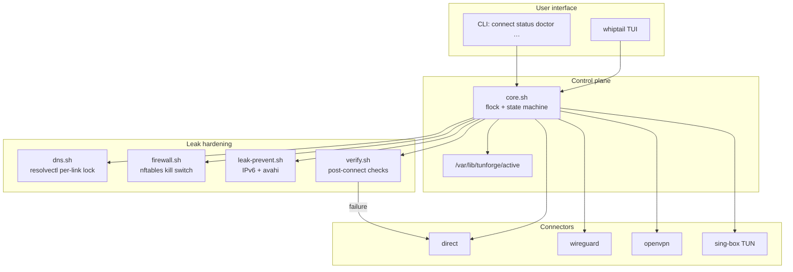

# Tunforge

**Tunforge** is a single-source-of-truth VPN control plane for Ubuntu 22.04. It manages four mutually exclusive connection profile types and prevents DNS, IP, and IPv6 leaks — including across profile switches.

- **Direct** — no VPN; router-supplied DNS
- **WireGuard** — `wg-quick`-based, multi-server
- **OpenVPN** — `.ovpn` configs, multi-server
- **sing-box TUN** — system-wide tunnel for VMess / VLESS / Trojan / Shadowsocks

A `whiptail` TUI is the primary interface. Operations are serialized under `flock`, the previous profile is fully torn down before the next comes up, DNS is locked to the tunnel via `systemd-resolved` per-link routing, an `nftables` kill switch is installed, and IPv6 is disabled system-wide while a non-direct profile is active.

**Status:** tested and working on Ubuntu 22.04 (amd64 / arm64).

---

## Architecture

Tunforge is a small control plane: one CLI/TUI process owns connect/disconnect under a global lock, delegates tunnel bring-up to a connector, then hardens the host (DNS, nftables, IPv6) and verifies before declaring success.



**Connect path (happy path):**

1. Acquire `flock` on `/var/lib/tunforge/lock`
2. Tear down the previous profile completely (connector down + DNS revert + firewall clear + IPv6 restore as needed)
3. Bring up the selected connector (WireGuard / OpenVPN / sing-box / direct)
4. Lock DNS to the tunnel iface (`resolvectl` + `~.` route-only domain)
5. Install the nftables kill switch (`inet tunforge`, output drop by default)
6. Disable IPv6 (non-direct) and stop LAN discovery noise
7. Run `verify.sh`; on failure, auto-rollback to direct

**Design principles:**

| Principle | How |
|---|---|
| Single source of truth | `/var/lib/tunforge/active` updated atomically; only one profile at a time |
| Serialized mutations | All connect/disconnect paths take the same flock |
| Fail closed | Kill switch + verify rollback; boot unit re-applies firewall before NetworkManager |
| Pluggable tunnels | Connectors share a thin contract; core owns policy, not protocol details |

Repo layout mirrors the runtime layout under `/usr/local` and `/etc/tunforge` (see [Layout](#layout)).

---

## Install (Ubuntu 22.04)

```bash
git clone <this-repo> tunforge
cd tunforge
sudo ./install.sh
```

What the installer does:

1. Preflight: Ubuntu 22.04 / `--force` for others, root, arch (amd64 / arm64), `systemd-resolved` present.
2. Apt: installs only what's missing — `wireguard-tools openvpn nftables whiptail iproute2 curl jq gawk dnsutils ca-certificates moreutils`.
3. sing-box: fetches the latest `.deb` from GitHub Releases for your arch, verifies SHA256 if a `.sha256` sidecar exists, then `dpkg -i`. Skip with `--no-singbox` or supply an offline `.deb` with `--singbox-deb /path/to/file.deb`.
4. Deploys binaries into `/usr/local/bin/`, libraries into `/usr/local/lib/tunforge/`, configs into `/etc/tunforge/`.
5. Installs `NetworkManager` and `systemd-resolved` drop-ins so they stop fighting over DNS / VPN interfaces, and points `/etc/resolv.conf` at the systemd stub (with backup).
6. Enables `tunforge-killswitch.service` so a reboot mid-VPN cannot leak.

Re-runs are safe (idempotent). Pass `--check` for a dry run.

```bash
sudo ./install.sh --check
sudo ./install.sh --no-singbox
sudo ./install.sh --singbox-deb ./sing-box_1.10.3_linux_amd64.deb
```

## Uninstall

```bash
sudo ./uninstall.sh           # removes Tunforge but keeps your profiles + configs
sudo ./uninstall.sh --purge   # also wipes /etc/tunforge and /var/lib/tunforge
```

Apt packages are left in place (they may be used elsewhere). A removal hint is printed at the end.

---

## Quick start

1. Drop your config files:

   - WireGuard: `/etc/tunforge/configs/wireguard/de1.conf` (chmod 600 — contains a private key)
   - OpenVPN:   `/etc/tunforge/configs/openvpn/nl1.ovpn`
   - sing-box:  `/etc/tunforge/configs/singbox/jp1.json`

   For V2Ray-style URIs (`vmess://`, `vless://`, `trojan://`, `ss://`) skip step 1 and use the importer:

   ```bash
   sudo tunforge import 'vless://uuid@server:443?security=tls&type=ws&path=/api#JP-Tokyo'
   ```

   The importer writes both a sing-box JSON config and a profile descriptor (named after the URI's `#label`, e.g. `jp-tokyo`). You can also pass an explicit name as the second argument, paste from stdin (`pbpaste | sudo tunforge import -`), or batch-import a file (`sudo tunforge import -f subscriptions.txt`). See [V2Ray URI import](#v2ray-uri-import) below.

2. Create a profile descriptor in `/etc/tunforge/profiles/<name>.profile`. Two shortcuts:

   ```bash
   sudo tunforge scaffold     # creates profiles for any configs that don't have one
   ```

   or use the TUI action **Manage profiles → Scaffold from existing configs**. Existing profiles are never overwritten. The importer also skips this step (it produces both files).

3. Launch:

   ```bash
   sudo tunforge
   ```

   - **Connect** — switch profiles (radio list; `*` marks the active one)
   - **Disconnect** — return to direct mode
   - **Status** — active profile, iface, DNS in use, public IP via tunnel
   - **Live logs** — colorized journald tail
   - **Doctor** — health check + kill-switch ruleset dump

CLI is also available for scripting:

```bash
sudo tunforge list
sudo tunforge connect wg-de1
sudo tunforge status
sudo tunforge doctor
sudo tunforge disconnect
sudo tunforge import '<uri>'
sudo tunforge bypass add backend.local
sudo tunforge bypass add-cidr 172.17.0.0/16
tunforge logs
```

---

## V2Ray URI import

Providers usually hand you a one-line URI. Tunforge converts it into a sing-box config + profile in one shot:

```bash
sudo tunforge import 'vless://...#JP-Tokyo'           # name = JP-Tokyo (slugified)
sudo tunforge import 'vmess://eyJ2I...' jp-tokyo      # explicit profile name
echo "$URI" | sudo tunforge import -                  # from stdin (pbpaste / xclip)
sudo tunforge import -f ~/subs.txt                    # batch (one URI per line)
```

Supported schemes:

| Scheme | Notes |
|---|---|
| `vmess://` | Base64-encoded V2RayN JSON dialect, with `tcp` / `ws` / `grpc` / `http` transports and TLS. |
| `vless://` | URL-style. Supports TLS + uTLS fingerprint + REALITY (`security=reality&pbk=...&sid=...`). |
| `trojan://` | URL-style with TLS + `ws` / `grpc` transports. |
| `ss://` | Shadowsocks, both legacy `base64(method:pass@host:port)` and SIP002 `base64(method:pass)@host:port`. |

After import, edit `/etc/tunforge/profiles/<name>.profile` if you want to tweak DNS servers, then:

```bash
sudo tunforge connect <name>
```

Unusual transports (xtls-rprx-vision + REALITY, custom obfs, plugin-based shadowsocks, etc.) may need a hand edit — `sing-box check -c /etc/tunforge/configs/singbox/<name>.json` will tell you what to fix.

---

## V2Ray subscriptions (soft sub)

A *subscription* is a remote URL that returns a **list** of V2Ray URIs (usually base64-encoded, one per line). Store the URL once and **refresh** it to pull the provider's current server list — old servers are removed and new ones added automatically.

```bash
sudo tunforge subscription add https://provider.example/sub?token=abc myprovider
sudo tunforge subscription update myprovider
sudo tunforge subscription update all
sudo tunforge subscription list
sudo tunforge subscription remove myprovider
```

Each server becomes its own profile named `<sub>-NN` (e.g. `myprovider-01`) tagged with `SOURCE=<sub>`, so it appears in the normal connect picker. The server's human label is kept in `DESC`. Connect as usual:

```bash
sudo tunforge connect myprovider-01
```

`update` fully rebuilds that subscription's server set: it deletes previously generated profiles (and sing-box configs) for that subscription, then re-imports the fresh list. Hand-imported profiles and other subscriptions are never touched. If the subscription host's DNS is poisoned, the fetch retries with the host pinned to an IP resolved via direct public DNS. Also available from the TUI under **Manage V2Ray subscriptions (soft sub)**.

---

## Profile file (`/etc/tunforge/profiles/<name>.profile`)

```bash
TYPE=wireguard           # direct | wireguard | openvpn | singbox
DESC="Germany #1"
COUNTRY=Germany          # optional display label; if omitted, Tunforge caches geo country after a verified connect
CONFIG=/etc/tunforge/configs/wireguard/de1.conf
DNS_SERVERS="1.1.1.1 9.9.9.9"   # required for VPN types; NEVER 8.8.8.8 — see below
DNS_OVER_TLS=opportunistic        # off | opportunistic | yes
KILL_SWITCH=yes                   # default-drop firewall while active
IPV6=disable                      # disable (recommended) | allow
ENDPOINT_IP=203.0.113.45          # optional: pin so we don't need DNS at connect
MTU=1280                          # optional: useful on hostile networks
```

---

## How leak protection works

| Layer | Mechanism |
|---|---|
| DNS | `resolvectl dns <iface> <servers>` + `resolvectl domain <iface> '~.'` makes the VPN iface the **only** resolver. Every other link is `resolvectl revert`-ed. Successful resolutions are cached in `/var/lib/tunforge/dns-cache` (default 24h TTL). `tunforge dns-cache clear` resets it. |
| Routes | WireGuard / OpenVPN / sing-box install a default route via the tunnel (`Table=auto`, `redirect-gateway def1`, `auto_route+strict_route`). |
| Kill switch | `nftables` table `inet tunforge` with `output policy drop`. Only `lo`, the tunnel iface, resolved VPN endpoint IPs on the WAN, configured local bypass CIDRs, and DHCP renewal are allowed. |
| IPv6 | `sysctl net.ipv6.conf.{all,default}.disable_ipv6=1` while a non-direct profile is active. Kill-switch v6 chains drop everything as belt-and-braces. |
| mDNS / LLMNR | `MulticastDNS=no` + `LLMNR=no` in `resolved.conf.d/tunforge.conf`. `avahi-daemon` is stopped while VPN is active. |
| Boot | `tunforge-killswitch.service` re-applies the firewall **before** `NetworkManager.service` if `/var/lib/tunforge/active` is non-`none`, so a reboot mid-VPN cannot leak. |
| Single source of truth | Connect/disconnect operations are serialized by `flock /var/lib/tunforge/lock`. State file `/var/lib/tunforge/active` is updated atomically. The TUI runs a health check on launch and offers to reset on drift. |
| Post-connect verification | `verify.sh` checks: iface up, default v4 route via tunnel, `~.` domain on tunnel only, public IP via tunnel, DNS via stub, IPv6 default absent or also on tunnel. **Failure auto-rolls back to direct mode.** |

### Local development bypass

Local development networks are bypassed by default while the VPN is on:

```text
127.0.0.0/8
10.0.0.0/8
172.16.0.0/12
192.168.0.0/16
169.254.0.0/16
```

This keeps localhost, LAN services, and Docker-style private networks reachable. Add your own:

```bash
sudo tunforge bypass add-cidr 172.17.0.0/16
sudo tunforge bypass add-domain backend.local
sudo tunforge bypass add mongodb://mongo.dev:27017
tunforge bypass list
```

CIDR entries allow that traffic outside the VPN. Domain entries route matching DNS names to the WAN link's DNS while the default `~.` resolver stays pinned to the tunnel. Changes apply on the next reconnect. Set `TUNFORGE_BYPASS_DEFAULTS=0` to disable the built-in local CIDRs.

### Why Google DNS is forbidden

`8.8.8.8` and `8.8.4.4` are operated by the same vendor as Gmail / Workspace / Firebase. Using them lets that resolver correlate DNS patterns against account activity, even via a VPN. The profile loader hard-rejects them. Prefer Cloudflare (`1.1.1.1`), Quad9 (`9.9.9.9`), or another non-FAANG resolver — ideally one in your VPN exit country.

---

## What this does not solve (browser layer)

System-level routing cannot fix:

- **WebRTC** — browsers can probe your real IP via STUN. Firefox: `about:config` → `media.peerconnection.enabled=false`. Chromium: WebRTC Network Limiter extension.
- **Browser fingerprinting** — canvas, fonts, time zone, language. Match system time zone to the VPN exit (`timedatectl set-timezone Europe/Berlin`) or use a per-exit browser profile.
- **Logged-in account correlation** — signing in from your real IP and later from a VPN exit correlates the sessions. Use separate browser profiles per exit.
- **HTTP/3 (QUIC)** — with the kill switch this is fine (UDP/443 not via tunnel is dropped); with the kill switch off you may see unexpected traffic.

---

## Layout

```
/usr/local/bin/tunforge                  whiptail TUI + CLI
/usr/local/bin/tunforge-logs             colorized journald tail
/usr/local/bin/tunforge-import           V2Ray URI → sing-box JSON + profile
/usr/local/bin/tunforge-subscription     V2Ray soft-sub URL → refreshable server list
/usr/local/bin/tunforge-scaffold         create .profile files for existing configs
/usr/local/lib/tunforge/
    core.sh                             flock, state machine, dispatch
    dns.sh                              resolvectl-based DNS lock
    firewall.sh                         nftables kill switch
    leak-prevent.sh                     IPv6 sysctl, avahi
    verify.sh                           post-connect verification
    nm-tame.sh                          NM + resolved configurator
    connectors/{direct,wireguard,openvpn,singbox}.sh

/etc/tunforge/
    config.yaml                         global config
    profiles/<name>.profile             one per profile
    configs/{wireguard,openvpn,singbox}/...
    templates/singbox-tun.json.tmpl

/var/lib/tunforge/
    active                              authoritative current profile
    dns-cache                           successful DNS resolutions (host → ip)
    test-cache                          ping/TCP probe results (used by TUI)
    active.iface                        current tun iface name
    lock                                flock target
    leak.snapshot                       sysctl baseline for restore
    firewall.params                     persisted killswitch params (boot reapply)

/etc/systemd/system/tunforge-killswitch.service
/etc/systemd/system/tunforge@.service    (parameterized; boot-time auto-up)
/etc/NetworkManager/conf.d/99-tunforge.conf
/etc/systemd/resolved.conf.d/tunforge.conf
```

---

## Contributing

Contributions are welcome — whether you are fixing a bug on Ubuntu 22.04, hardening leak paths, adding a connector, or improving docs.

**Good first areas:**

- Connector edge cases (WireGuard / OpenVPN / sing-box bring-up and teardown)
- DNS / nftables / IPv6 leak scenarios and verification coverage
- Installer portability and clearer operator messaging
- TUI/CLI UX and documentation

**How to contribute:**

1. Fork the repo and create a focused branch (`feat/…`, `fix/…`, or `docs/…`)
2. Keep changes scoped; prefer one concern per PR
3. Test on Ubuntu 22.04 when touching networking, DNS, or firewall code
4. Open a pull request that explains the problem, the approach, and how you verified it

If you are unsure where to start, open an issue describing your environment and the failure (or the feature you want). Serious reviews of architecture and security assumptions are especially appreciated.

---

## Troubleshooting

```bash
sudo tunforge doctor       # health check + ruleset dump
sudo tunforge logs         # live tail
sudo tunforge disconnect   # nuke everything, return to direct
sudo nft list table inet tunforge
resolvectl status
ip -4 route get 1.1.1.1
```

If `verify.sh` rolled you back, the failure reason is in `journalctl -t tunforge -n 50`.
